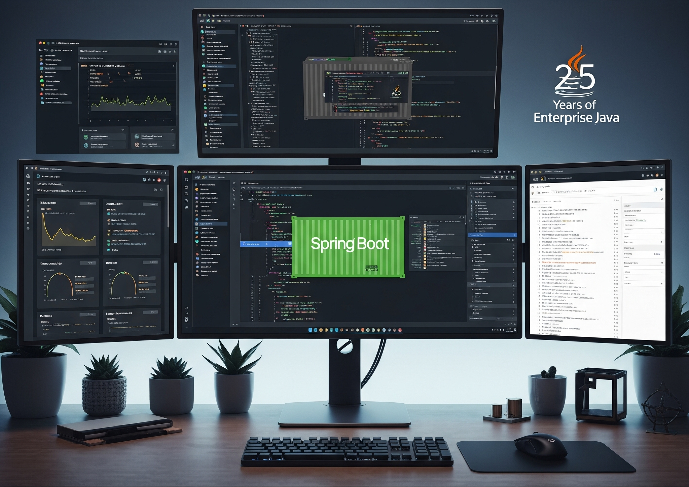

# 🌋 The Great Java Web Awakening: MM's Odyssey Through Enterprise Evolution

---

## 🌅 Prologue: The Oracle of Silicon Valley

In the sprawling digital metropolis of enterprise software development, where application servers tower like ancient monoliths and frameworks evolve like species in an accelerated ecosystem, there lived a legendary developer known simply as **MM**. 

Short for *"Maven Master"* to some, *"Memory Manager"* to others, but truly standing for *"Millennium Migrator"*—MM had witnessed every seismic shift in Java web development since the late 1990s. Their weathered IDE shortcuts and muscle memory of deprecated APIs told the complete story of Java's transformation from heavyweight enterprise behemoth to nimble, cloud-native microservice champion.

This is MM's epic chronicle—a twenty-five-year journey through the volcanic eruptions of enterprise frameworks, the ice ages of XML configuration, and the renaissance of annotation-driven development.

---

## 🏛️ Chapter 1: The Age of Enterprise Java Beans *(Late 1990s - Early 2000s)*

### 💼 **The Corporate Colossus**

Our saga begins in the cathedral-like halls of enterprise development, where MM first encountered the magnificent yet intimidating world of `Enterprise Java Beans (EJB)`. Picture a young MM, armed with thick O'Reilly books 📚 and an unwavering determination to conquer the corporate software landscape.

> *"EJB felt like digital architecture from a lost civilization,"* MM recalls, their voice echoing with the weight of countless deployment descriptors. *"Everything was grand, ceremonial, and required an army of XML scribes to maintain."*

```xml
<!-- The ancient rituals of EJB deployment -->
<ejb-jar>
  <enterprise-beans>
    <session>
      <ejb-name>CustomerService</ejb-name>
      <home>com.enterprise.CustomerHome</home>
      <remote>com.enterprise.Customer</remote>
      <ejb-class>com.enterprise.CustomerBean</ejb-class>
      <session-type>Stateless</session-type>
      <transaction-type>Container</transaction-type>
    </session>
  </enterprise-beans>
</ejb-jar>
```

### ⚔️ **The Heavyweight Champions**

In those primordial days, MM learned to navigate the trinity of EJB components: `Session Beans`, `Entity Beans`, and `Message-Driven Beans`. Each required elaborate ceremonies of interface definitions, home objects, and deployment descriptors that read like ancient incantations.

```java
// The ceremonial dance of EJB 2.x
public interface CustomerHome extends EJBHome {
    public Customer create(String customerId) 
        throws CreateException, RemoteException;
    public Customer findByPrimaryKey(String customerId) 
        throws FinderException, RemoteException;
}

public interface Customer extends EJBObject {
    public String getName() throws RemoteException;
    public void setName(String name) throws RemoteException;
}
```

🏗️ **The Cathedral Builders**

MM spent months learning the intricate patterns: `Data Access Objects`, `Business Delegates`, `Service Locators`. Application servers like `WebLogic`, `WebSphere`, and `JBoss` were massive cathedrals requiring specialized priests (system administrators) to maintain their complex configurations.

> *"Deploying an EJB application was like conducting a symphony orchestra,"* MM reminisces. *"Every component had to be perfectly orchestrated, every XML file precisely crafted. One misplaced tag could bring down the entire production server."*

But the digital tectonic plates were shifting. The heavyweight enterprise approach, while powerful, was becoming a burden. Startup times measured in minutes, memory consumption in gigabytes, and the sheer complexity of development began to show cracks in the enterprise cathedral.

---

## 📜 Chapter 2: The Servlet and JSP Renaissance *(Early 2000s)*

### 🌐 **The Web Awakening**

As the internet evolved from a research network to the global information highway, MM witnessed the emergence of web-based applications. `Java Servlets` and `JavaServer Pages (JSP)` represented the first true adaptation of Java to the web ecosystem.

```java
// The raw power of early servlets
public class CustomerServlet extends HttpServlet {
    protected void doGet(HttpServletRequest request, 
                        HttpServletResponse response) 
            throws ServletException, IOException {
        
        String customerId = request.getParameter("id");
        CustomerService service = new CustomerService();
        Customer customer = service.findCustomer(customerId);
        
        request.setAttribute("customer", customer);
        RequestDispatcher dispatcher = 
            request.getRequestDispatcher("/customer.jsp");
        dispatcher.forward(request, response);
    }
}
```

### 🎭 **The Theater of JSP**

`JSP` brought the ability to embed Java code directly in HTML, creating a new form of digital theater where presentation and logic danced together in intricate, sometimes chaotic, choreography.

```jsp
<%-- The artistic chaos of scriptlet-heavy JSP --%>
<%@ page import="com.enterprise.Customer" %>
<html>
<body>
    <% 
        Customer customer = (Customer) request.getAttribute("customer");
        if (customer != null) {
    %>
        <h1>Welcome, <%= customer.getName() %>!</h1>
        <p>ID: <%= customer.getId() %></p>
    <% 
        } else {
    %>
        <h1>Customer not found!</h1>
    <%
        }
    %>
</body>
</html>
```

> *"JSP was liberating and terrifying simultaneously,"* MM reflects. *"We could finally build dynamic web pages with Java, but the mixing of code and markup created maintenance nightmares that haunted us for years."*

🎨 **The Pattern Revolution**

To tame the chaos, MM learned about the `Model-View-Controller (MVC)` pattern. Frameworks like `Apache Struts` emerged as the guiding light, providing structure to the wild west of web development.

```xml
<!-- Struts configuration: Order through XML -->
<struts-config>
    <action-mappings>
        <action path="/customer"
                type="com.enterprise.CustomerAction"
                scope="request">
            <forward name="success" path="/customer.jsp"/>
            <forward name="error" path="/error.jsp"/>
        </action>
    </action-mappings>
</struts-config>
```

---

## 🌸 Chapter 3: The Spring Renaissance *(Mid-2000s)*

### 💡 **The Enlightenment**

Then came the revolution that would reshape MM's understanding of enterprise development: the `Spring Framework`. Created by Rod Johnson as a reaction against the complexity of EJB, Spring introduced concepts that seemed almost revolutionary at the time.

> *"Spring felt like stepping out of a dark cave into sunlight,"* MM says, their eyes bright with the memory of discovery. *"Suddenly, Plain Old Java Objects (POJOs) were first-class citizens again. We didn't need to extend framework classes or implement heavyweight interfaces."*

```java
// The beautiful simplicity of Spring POJOs
public class CustomerService {
    private CustomerRepository customerRepository;
    
    // Constructor injection - so clean!
    public CustomerService(CustomerRepository customerRepository) {
        this.customerRepository = customerRepository;
    }
    
    public Customer findCustomer(String customerId) {
        return customerRepository.findById(customerId);
    }
}
```

### 🔧 **The Dependency Injection Miracle**

`Dependency Injection` transformed how MM thought about object relationships. Instead of objects creating their dependencies, Spring's `Inversion of Control` container became the benevolent orchestrator.

```xml
<!-- The XML poetry of Spring configuration -->
<beans>
    <bean id="customerRepository" 
          class="com.enterprise.JdbcCustomerRepository">
        <property name="dataSource" ref="dataSource"/>
    </bean>
    
    <bean id="customerService" 
          class="com.enterprise.CustomerService">
        <constructor-arg ref="customerRepository"/>
    </bean>
</beans>
```

🎯 **The AOP Revolution**

`Aspect-Oriented Programming` allowed MM to separate cross-cutting concerns like logging, security, and transactions from business logic—a concept as revolutionary as the discovery of antibiotics in medicine.

```java
@Service
@Transactional
public class CustomerService {
    
    @Autowired
    private CustomerRepository customerRepository;
    
    @Cacheable("customers")
    public Customer findCustomer(String customerId) {
        return customerRepository.findById(customerId);
    }
}
```

---

## 🚂 Chapter 4: The Annotation Revolution *(Late 2000s)*

### 📝 **The Great Simplification**

As MM's career progressed into the late 2000s, another seismic shift occurred: the move from `XML configuration` to `annotation-based development`. It was like watching the transition from hieroglyphics to the modern alphabet.

> *"Annotations brought the configuration closer to the code,"* MM explains, gesturing to their modern IDE. *"Instead of hunting through dozens of XML files, the metadata lived right where it belonged—with the code itself."*

```java
// The elegance of annotation-driven development
@Controller
@RequestMapping("/customers")
public class CustomerController {
    
    @Autowired
    private CustomerService customerService;
    
    @RequestMapping(value = "/{id}", method = RequestMethod.GET)
    public ModelAndView getCustomer(@PathVariable String id) {
        Customer customer = customerService.findCustomer(id);
        return new ModelAndView("customer", "customer", customer);
    }
}
```

### 🌐 **The Spring MVC Evolution**

`Spring MVC` emerged as the natural evolution of web frameworks, providing clean separation of concerns while maintaining the flexibility that made Spring famous.

```java
@Service
public class CustomerService {
    
    @Autowired
    private CustomerRepository customerRepository;
    
    @Transactional(readOnly = true)
    @Cacheable(value = "customers", key = "#customerId")
    public Customer findCustomer(String customerId) {
        return customerRepository.findById(customerId);
    }
    
    @Transactional
    @CacheEvict(value = "customers", key = "#customer.id")
    public void updateCustomer(Customer customer) {
        customerRepository.save(customer);
    }
}
```

---

## ☁️ Chapter 5: The Cloud Native Spring Boot Era *(2010s-Present)*

### 🚀 **The Microservice Migration**

The 2010s brought the most profound transformation MM had ever witnessed: the shift from monolithic applications to `microservices`, and with it, the birth of `Spring Boot`. This wasn't just an evolution—it was a complete metamorphosis of how enterprise applications were conceived, built, and deployed.

> *"Spring Boot was the culmination of everything we'd learned,"* MM says, their voice filled with admiration. *"Convention over configuration, embedded servers, auto-configuration—it turned what used to take weeks of setup into a single annotation."*

```java
// The modern miracle of Spring Boot
@SpringBootApplication
@RestController
public class CustomerApplication {
    
    @Autowired
    private CustomerService customerService;
    
    public static void main(String[] args) {
        SpringApplication.run(CustomerApplication.class, args);
    }
    
    @GetMapping("/customers/{id}")
    public ResponseEntity<Customer> getCustomer(@PathVariable String id) {
        Customer customer = customerService.findCustomer(id);
        return ResponseEntity.ok(customer);
    }
}
```

### 🏗️ **The Architecture Revolution**

```
Traditional Monolith vs Microservices Evolution:

┌─────────────────────────────────────┐    ┌──────┐ ┌──────┐ ┌──────┐
│           MONOLITH                  │ -> │ MS-A │ │ MS-B │ │ MS-C │
│  ┌─────┐ ┌─────┐ ┌─────┐ ┌─────┐    │    └──────┘ └──────┘ └──────┘
│  │ Web │ │ Svc │ │ Data│ │ Intg│    │        │        │       │
│  └─────┘ └─────┘ └─────┘ └─────┘    │    ┌──────┐ ┌──────┐ ┌──────┐
│             WAR/EAR                 │    │ DB-A │ │ DB-B │ │ DB-C │
└─────────────────────────────────────┘    └──────┘ └──────┘ └──────┘
      Application Server                     Docker + Cloud
```

### 🔧 **The DevOps Integration**

Spring Boot's embedded servers eliminated the need for external application servers, making applications truly self-contained and cloud-ready.

```yaml
# Modern Spring Boot configuration
server:
  port: 8080
  
spring:
  datasource:
    url: jdbc:postgresql://localhost:5432/customers
    username: ${DB_USER:admin}
    password: ${DB_PASSWORD:secret}
  
  jpa:
    hibernate:
      ddl-auto: validate
    show-sql: false
    
management:
  endpoints:
    web:
      exposure:
        include: health,info,metrics,prometheus
```

### 🎯 **The Reactive Revolution**

The latest chapter in MM's journey has been the emergence of `Spring WebFlux` and reactive programming, representing the next evolution in handling modern web application demands.

```java
// The reactive future
@RestController
public class ReactiveCustomerController {
    
    @Autowired
    private ReactiveCustomerService customerService;
    
    @GetMapping("/customers/{id}")
    public Mono<Customer> getCustomer(@PathVariable String id) {
        return customerService.findCustomer(id);
    }
    
    @GetMapping(value = "/customers/stream", 
                produces = MediaType.TEXT_EVENT_STREAM_VALUE)
    public Flux<Customer> streamCustomers() {
        return customerService.findAllCustomers()
            .delayElements(Duration.ofSeconds(1));
    }
}
```

---

## 🌅 Epilogue: The Wisdom of Ages

### 🧠 **The Master's Reflection**

Today, as MM stands in their modern development environment, containers humming with Spring Boot microservices, they marvel at the complete transformation of enterprise Java development.

> *"From the XML cathedrals of EJB to the elegant simplicity of Spring Boot,"* MM reflects, *"we've witnessed the complete democratization of enterprise development. What once required teams of architects and months of configuration can now be accomplished by a single developer in an afternoon."*

## 📊 The Java Web Evolution Timeline

```
1999      2003      2007       2011            2015      2020
 │         │         │          │               │         │
EJB ──→ Servlets ──→ Spring ──→ Annotations ──→ Boot  ──→ Reactive
 │         │         │          │               │         │
Heavy    Manual     DI/AOP     Metadata         Auto      Non-blocking      
XML      Wiring     POJOs      Driven           Config    Streaming
Ceremony  MVC       Clean      Simple           Cloud     Resilient
```

### 🏆 **The Lessons Learned**

**From MM's Developer Journal:**

1. **🏗️ Complexity vs. Simplicity**: *"Every technology swing from complex to simple and back. The wise developer learns to embrace simplicity when possible."*

2. **📝 Configuration Evolution**: *"We went from no configuration (hardcoded), to XML hell, to annotation heaven. Each step taught us about maintainability."*

3. **🔄 Framework Lifecycle**: *"Frameworks are born from frustration with existing solutions. Spring emerged from EJB complexity, Boot from Spring's boilerplate."*

4. **☁️ Infrastructure as Code**: *"The cloud transformed how we think about deployment. Applications became cattle, not pets."*

### 🎭 **The Eternal Dance**

MM's journey from `Enterprise Java Beans` to `Spring Boot` represents more than technological evolution—it's the story of the software industry's maturation. Each framework, each paradigm shift, each architectural revolution brought us closer to the ideal: **elegant, maintainable, scalable applications that solve real business problems.**

As MM now mentors the next generation of developers, teaching them about `Spring Boot`, `Kubernetes`, and `reactive programming`, they see the cycle continuing. Somewhere, a new framework is being born from someone's frustration with current limitations.

---

### 🌟 *"In the great migration from enterprise complexity to cloud-native simplicity, every line of code tells a story. Every deprecated API carries the wisdom of lessons learned. Every new framework stands on the shoulders of giants who dared to dream of better ways to build software."*

---

**🎬 The Documentary Continues...**

*As our cameras pan across MM's modern development setup—multiple monitors displaying Spring Boot applications running in Docker containers, metrics flowing through Prometheus, logs streaming through Elasticsearch—we see not just the tools of modern development, but the culmination of twenty-five years of enterprise Java evolution.*

*The story continues, and somewhere in a bustling startup or enterprise development center, a new developer is about to begin their own journey through the ever-evolving landscape of Java web development.* 🚀

**[Fade to the gentle hum of continuous integration pipelines and the soft glow of green build status indicators]** ✅

